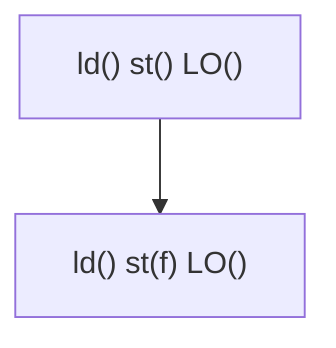
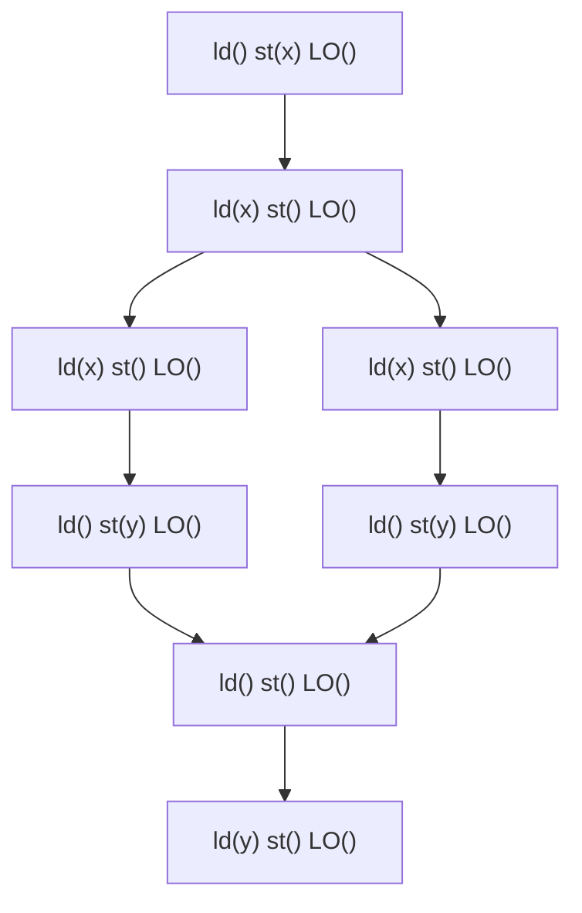

```python

def f(x):
    if x > 0:
        y = x
    else:
        y = -x
    return y

```
__main__

```mermaid
graph TB
  N2778282054288["ld() st() LO()"]
  N2778282054288 --> N2778282054736
  N2778282054736["ld() st(f) LO()"]
```
f

```mermaid
graph TB
  N2778282055184["ld() st(x) LO()"]
  N2778282055184 --> N2778282055696
  N2778282055696["ld(x) st() LO()"]
  N2778282055696 --> N2778282056144
  N2778282056144["ld(x) st() LO()"]
  N2778282056144 --> N2778282056400
  N2778282056400["ld() st(y) LO()"]
  N2778282056400 --> N2778282057296
  N2778282057296["ld() st() LO()"]
  N2778282057296 --> N2778282057488
  N2778282057488["ld(y) st() LO()"]
  N2778282055696 --> N2778282056976
  N2778282056976["ld(x) st() LO()"]
  N2778282056976 --> N2778282057168
  N2778282057168["ld() st(y) LO()"]
  N2778282057168 --> N2778282057296
```
