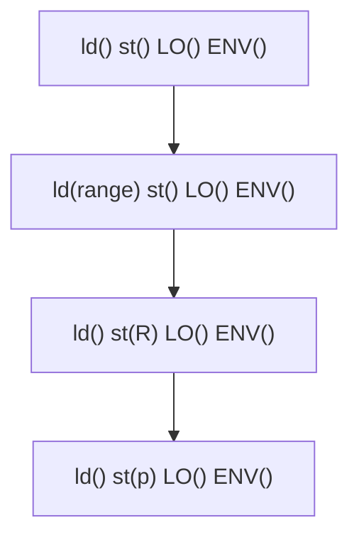
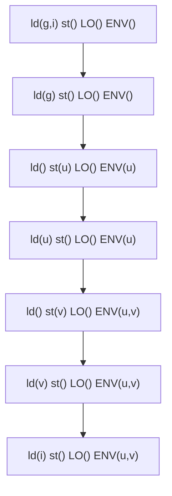
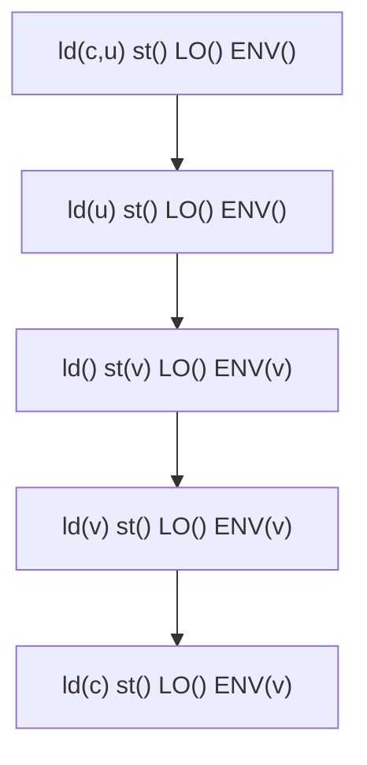
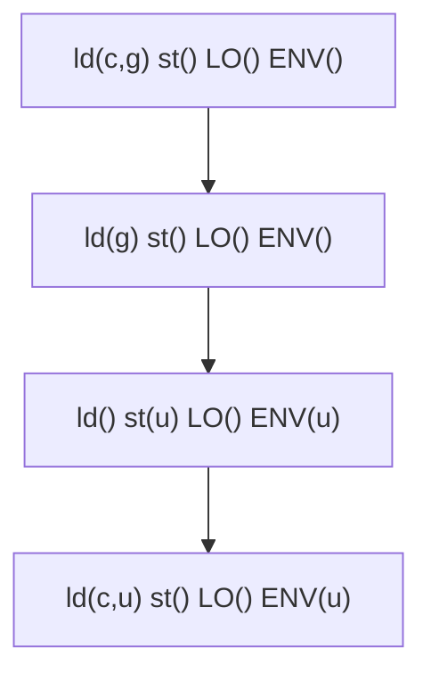
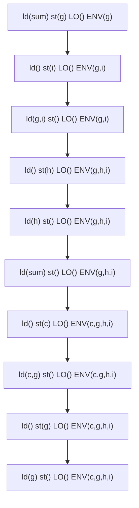

```python

R=range
def p(g):
 i=0
 h=[v==i for u in g for v in u]
 c=sum(h)
 g=[[v * c for v in u] for u in g]
 return g

```
__main__

```mermaid
graph TB
  N1886106509456["ld() st() LO() ENV()"]
  N1886106509456 --> N1886106508880
  N1886106508880["ld(range) st() LO() ENV()"]
  N1886106508880 --> N1886106508944
  N1886106508944["ld() st(R) LO() ENV()"]
  N1886106508944 --> N1886106508752
  N1886106508752["ld() st(p) LO() ENV()"]
```
anon-0

```mermaid
graph TB
  N1886106501392["ld(g,i) st() LO() ENV()"]
  N1886106501392 --> N1886106508560
  N1886106508560["ld(g) st() LO() ENV()"]
  N1886106508560 --> N1886106504336
  N1886106504336["ld() st(u) LO() ENV(u)"]
  N1886106504336 --> N1886106504208
  N1886106504208["ld(u) st() LO() ENV(u)"]
  N1886106504208 --> N1886106506064
  N1886106506064["ld() st(v) LO() ENV(u,v)"]
  N1886106506064 --> N1886106504144
  N1886106504144["ld(v) st() LO() ENV(u,v)"]
  N1886106504144 --> N1886106506128
  N1886106506128["ld(i) st() LO() ENV(u,v)"]
```
anon-2

```mermaid
graph TB
  N1886106577488["ld(c,u) st() LO() ENV()"]
  N1886106577488 --> N1886106577360
  N1886106577360["ld(u) st() LO() ENV()"]
  N1886106577360 --> N1886106577680
  N1886106577680["ld() st(v) LO() ENV(v)"]
  N1886106577680 --> N1886106577936
  N1886106577936["ld(v) st() LO() ENV(v)"]
  N1886106577936 --> N1886106578320
  N1886106578320["ld(c) st() LO() ENV(v)"]
```
anon-1

```mermaid
graph TB
  N1886106574672["ld(c,g) st() LO() ENV()"]
  N1886106574672 --> N1886106576592
  N1886106576592["ld(g) st() LO() ENV()"]
  N1886106576592 --> N1886106577040
  N1886106577040["ld() st(u) LO() ENV(u)"]
  N1886106577040 --> N1886095222864
  N1886095222864["ld(c,u) st() LO() ENV(u)"]
```
p

```mermaid
graph TB
  N1886106501328["ld(sum) st(g) LO() ENV(g)"]
  N1886106501328 --> N1886106501456
  N1886106501456["ld() st(i) LO() ENV(g,i)"]
  N1886106501456 --> N1886106501264
  N1886106501264["ld(g,i) st() LO() ENV(g,i)"]
  N1886106501264 --> N1886106502928
  N1886106502928["ld() st(h) LO() ENV(g,h,i)"]
  N1886106502928 --> N1886106503056
  N1886106503056["ld(h) st() LO() ENV(g,h,i)"]
  N1886106503056 --> N1886106575120
  N1886106575120["ld(sum) st() LO() ENV(g,h,i)"]
  N1886106575120 --> N1886106576272
  N1886106576272["ld() st(c) LO() ENV(c,g,h,i)"]
  N1886106576272 --> N1886106576528
  N1886106576528["ld(c,g) st() LO() ENV(c,g,h,i)"]
  N1886106576528 --> N1886106576656
  N1886106576656["ld() st(g) LO() ENV(c,g,h,i)"]
  N1886106576656 --> N1886106580688
  N1886106580688["ld(g) st() LO() ENV(c,g,h,i)"]
```
